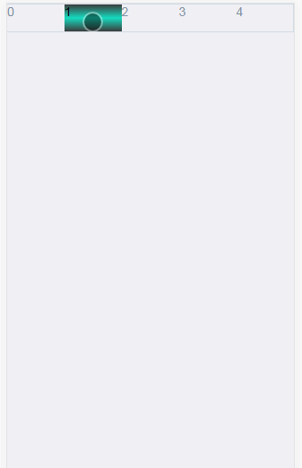
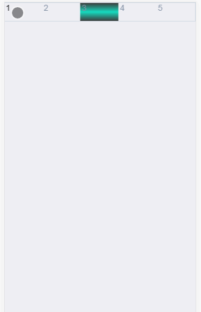
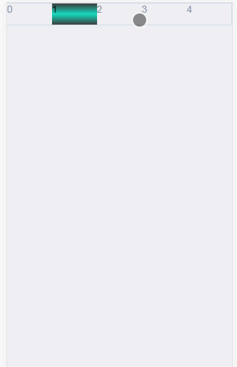

# Vue-Scrolltitle
vue scroll title

# Screenshots
场景|说明|截图| 
:------:|:------:|:------
 no animate（默认效果）|默认不启动过渡，不可滑动， |
 animate（启动动画过渡效果）| 设置`animate`属性，启动过渡，不可滑动 |
 slide（启动滑动效果）| 设置`slidable`属性，可以滑动，此设置会忽略`animate`属性,因为滑动必须启用过渡 |


# Usage

demo.vue
```html
<template>
    <div>
        <scroll-title v-model="s"
            animate
            showCount="5"
            speed="300">
            <scroll-title-item v-for="(v, i) in arr" :key="i" >
                {{v}}
            </scroll-title-item>
        </scroll-title>
    </div>
</template>
```

```javascript
import {ScrollTitle, ScrollTitleItem } from "./index"
export default {
    data(){
        return {
            arr: Array.from({length: 8}).map((t,k) => k),
            s: 3
        }
    },
    components: {
        ScrollTitle,
        ScrollTitleItem
    }
}
```
# Settings
